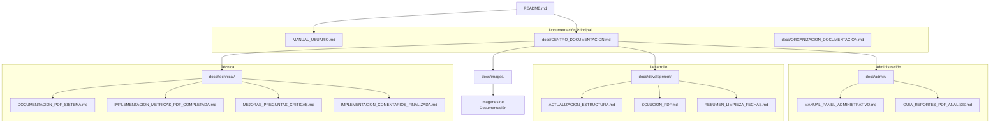

# 📚 Índice Visual de Documentación

<div align="center">


</div>

## 📑 Mapa de Documentación



## 🗂️ Estructura de Carpetas

```
/
├── README.md                           # Información general del proyecto
├── MANUAL_USUARIO.md                   # Manual principal para usuarios
├── CHANGELOG.md                        # Historial de cambios y versiones
├── CONTRIBUTING.md                     # Guía para contribuidores
├── LICENSE                             # Licencia del proyecto
│
└── /docs                               # Documentación centralizada
    ├── CENTRO_DOCUMENTACION.md         # Índice centralizado de documentación
    ├── ORGANIZACION_DOCUMENTACION.md   # Estándares de documentación
    ├── INDICE_VISUAL.md                # Este archivo (mapa visual)
    │
    ├── /admin                          # Documentación para administradores
    │   ├── MANUAL_PANEL_ADMINISTRATIVO.md
    │   └── GUIA_REPORTES_PDF_ANALISIS.md
    │
    ├── /development                    # Documentación de desarrollo
    │   ├── ACTUALIZACION_ESTRUCTURA.md
    │   ├── SOLUCION_PDF.md
    │   └── RESUMEN_LIMPIEZA_FECHAS.md
    │
    ├── /technical                      # Documentación técnica específica
    │   ├── DOCUMENTACION_PDF_SISTEMA.md
    │   ├── IMPLEMENTACION_METRICAS_PDF_COMPLETADA.md
    │   ├── MEJORAS_PREGUNTAS_CRITICAS.md
    │   └── IMPLEMENTACION_COMENTARIOS_FINALIZADA.md
    │
    └── /images                         # Recursos visuales
        ├── README.md
        └── [imágenes utilizadas en documentación]
```

## 📝 Convenciones de Documentación

| Tipo de Documento | Ubicación | Convención de Nombre |
|------------------|-----------|----------------------|
| Manuales Principales | Raíz | `MANUAL_*.md` |
| Guías de Administrador | `/docs/admin/` | `GUIA_*.md` o `MANUAL_*.md` |
| Documentación Técnica | `/docs/technical/` | `*_FINALIZADA.md` o `DOCUMENTACION_*.md` |
| Documentación de Desarrollo | `/docs/development/` | `*_ESTRUCTURA.md` o `SOLUCION_*.md` |
| Índices y Organización | `/docs/` | `*_DOCUMENTACION.md` |

---

<div align="center">

*Este índice visual forma parte de la iniciativa de mejora de documentación del Sistema de Encuestas Académicas.*

</div>
